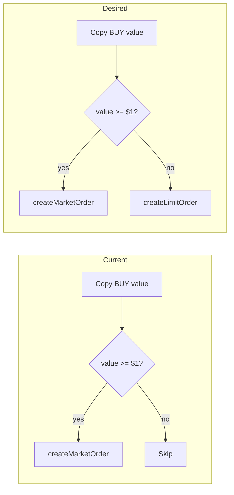

# Sub-$1 copy BUY via limit order

## Context

- **Current behavior**: In [src/services/smart-money-service.ts](src/services/smart-money-service.ts), when copy BUY value is below `minOrderSizeUsdc` ($1), the trade is **skipped** (lines 1086–1089). All copy orders are placed via `createMarketOrder`; [TradingService](src/services/trading-service.ts) rejects market orders with `amount < MIN_ORDER_VALUE_USDC` ($1) (lines 497–502).
- **Polymarket**: The $1 minimum is enforced for **market** (FOK/FAK) orders; limit orders can be used for sub-$1 amounts.
- **Goal**: When copy BUY value < $1, place a **limit order** instead of skipping, so small copy BUYs are still executed.

## Data flow (current vs desired)

## Implementation

### 1. TradingService: allow sub-minimum limit orders

**File**: [src/services/trading-service.ts](src/services/trading-service.ts)

- Add an optional flag to `LimitOrderParams`, e.g. `allowSubMinimum?: boolean`.
- In `createLimitOrder` (lines 430–444):
  - When `allowSubMinimum === true`, **skip** the checks `params.size < minOrderSize` and `orderValue < MIN_ORDER_VALUE_USDC`.
  - When `allowSubMinimum` is false or omitted, keep current behavior (reject below min size and $1).
- Document that `allowSubMinimum` is for sub-$1 copy trades; the CLOB API may still reject on some markets (e.g. minimum shares).

No new public method is required; a parameter keeps the API small and explicit.

### 2. SmartMoneyService: use limit order for sub-$1 BUY

**File**: [src/services/smart-money-service.ts](src/services/smart-money-service.ts)

- **Remove** the early return that skips BUY when `copyValue < minOrderSizeUsdc` (lines 1086–1089). Instead, allow the trade to continue and branch on order type later.
- **Execution branch** (where `createMarketOrder` is called, ~1134–1186):
  - If **BUY and copyValue < minOrderSizeUsdc**: call `this.tradingService.createLimitOrder({ tokenId, side: 'BUY', price: slippagePrice, size: copySize, minimumOrderSize: 0, allowSubMinimum: true })` (and `orderType: 'GTC'`). Do **not** run the FOK→FAK→market-price retry logic for this path (that is for market orders only).
  - Else: keep existing logic (createMarketOrder + FOK/FAK retries).
- **SELL**: Unchanged. Sub-$1 SELL already uses `getPositionSharesForToken` to sell full position when possible; no change there.
- **Rounding**: `createLimitOrder` uses `getTickSize` internally, so price/size rounding is already handled. Ensure `copySize` is a valid number (no extra rounding in SmartMoneyService unless needed for tick size; TradingService/CLOB will apply tick size).

Optional: add a log line when placing a sub-$1 BUY limit order so operators can see the behavior (e.g. `[SmartMoney] Copy BUY < $1, placing limit order`).

### 3. crypto-copy-trade.ts: enable sub-$1 BUY

**File**: [scripts/smart-money/crypto-copy-trade.ts](scripts/smart-money/crypto-copy-trade.ts)

- Today the script passes `minOrderSizeUsdc: MIN_TRADE_SIZE` (1) and the comment says "Skip BUY when copy value below this ($)". To allow sub-$1 BUYs to be sent as limit orders, either:
  - **Option A**: Lower `minOrderSizeUsdc` (e.g. set to `0.01` or a new constant `MIN_COPY_BUY_USDC = 0.01`) so that BUYs with value between $0.01 and $1 are not skipped and SmartMoneyService will use the new limit-order path; or
  - **Option B**: Add an option like `useLimitOrderForSubMinBuy: true` in the script and pass it to `startAutoCopyTrading`; SmartMoneyService would then need a new option (e.g. `useLimitOrderForSubMinBuy?: boolean`) and only use the limit-order path when that option is true and copyValue < minOrderSizeUsdc.

**Recommendation**: Option A is simpler: set `minOrderSizeUsdc` to a small value (e.g. `0.01`) in the script so that any copy BUY above that threshold is executed (market if ≥ $1, limit if < $1). No new option in the SDK; behavior is “always use limit for sub-$1 BUY” in SmartMoneyService. If you want to make sub-$1 limit orders opt-in per script, use Option B and add the option to `AutoCopyTradingOptions` and the script.

- Update the script comment for "Min trade size" to state that BUYs below $1 are sent as limit orders (and BUYs below the stated minimum are still skipped only when below the new `minOrderSizeUsdc`).

### 4. Edge cases and notes

- **Minimum shares**: Some markets enforce a minimum size in shares (e.g. 5). For sub-$1 limit orders, `copySize` may be small (e.g. 1–2 shares). Passing `minimumOrderSize: 0` in the limit-order call lets the SDK skip the client-side check; if the CLOB rejects, the order fails and `onTrade` / stats can record the failure. Alternatively, SmartMoneyService could try to resolve market by tokenId and use market `minimum_order_size` when available; that is a possible follow-up.
- **Order result shape**: `createLimitOrder` returns the same `OrderResult` shape as `createMarketOrder` (success, orderId, errorMsg). Copy-trade callbacks and logging can stay as-is.
- **Dry run**: Already handled; no change for dry run path.
- **Tests**: Consider a unit test in SmartMoneyService (or trading-service) that when copy BUY value is < $1, `createLimitOrder` is called with `allowSubMinimum: true` and no call to `createMarketOrder` for that trade.

## Summary

| Location                                                         | Change                                                                                                                                                                                                         |
| ---------------------------------------------------------------- | -------------------------------------------------------------------------------------------------------------------------------------------------------------------------------------------------------------- |
| [trading-service.ts](src/services/trading-service.ts)            | Add `allowSubMinimum?: boolean` to `LimitOrderParams`; in `createLimitOrder`, skip min size and $1 checks when true.                                                                                           |
| [smart-money-service.ts](src/services/smart-money-service.ts)    | Do not skip BUY when copyValue < minOrderSizeUsdc; in execution branch, if BUY and copyValue < minOrderSizeUsdc call `createLimitOrder` with `allowSubMinimum: true`, else keep `createMarketOrder` + retries. |
| [crypto-copy-trade.ts](scripts/smart-money/crypto-copy-trade.ts) | Set `minOrderSizeUsdc` to a small value (e.g. 0.01) so sub-$1 BUYs are sent as limit orders; update comment.                                                                                                   |

